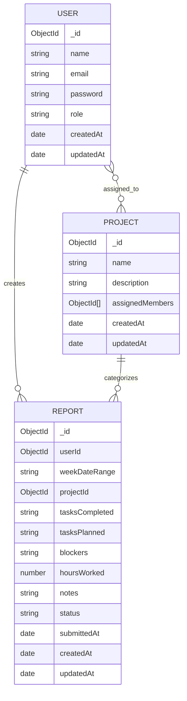

# ER Diagram

```mermaid
erDiagram
  USER ||--o{ REPORT : creates
  PROJECT ||--o{ REPORT : categorizes
  USER }o--o{ PROJECT : assigned_to

  USER {
    ObjectId _id
    string name
    string email
    string password
    string role
    date createdAt
    date updatedAt
  }

  PROJECT {
    ObjectId _id
    string name
    string description
    ObjectId[] assignedMembers
    date createdAt
    date updatedAt
  }

  REPORT {
    ObjectId _id
    ObjectId userId
    string weekDateRange
    ObjectId projectId
    string tasksCompleted
    string tasksPlanned
    string blockers
    number hoursWorked
    string notes
    string status
    date submittedAt
    date createdAt
    date updatedAt
  }
```